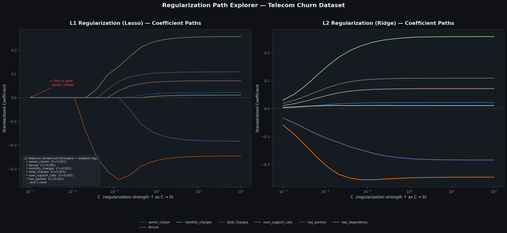

# Regularization Path Explorer
Module 5 — Week A Stretch Assignment | Honors Track

Visualizes how logistic regression coefficients change across 20 values of C (0.001 → 100) under L1 and L2 regularization, using the Telecom Churn dataset.

---

## Structure

```
regularization-explorer/
├── data/
│   └── telecom_churn.csv
├── regularization_path.py
├── regularization_path.png
├── requirements.txt
└── README.md
```

---

## Setup & Run

**1. Clone the repository**
```bash
git clone https://github.com/Marwan-ALMasrat/regularization-explorer.git
cd regularization-explorer
```

**2. Create and activate a virtual environment**

Windows:
```bash
python -m venv venv
.\.venv\Scripts\Activate.ps1
```

Mac/Linux:
```bash
python -m venv .venv
source venv/bin/activate
```

**3. Install dependencies**
```bash
pip install -r requirements.txt
```

**4. Run the script**
```bash
python regularization_path.py
```

Outputs `regularization_path.png` in the project root.

---

## Output



Two subplots — L1 (Lasso) and L2 (Ridge) — one line per feature, C on log scale. Features eliminated under L1 are annotated directly on the plot.

---

## L1 vs L2

| | L1 (Lasso) | L2 (Ridge) |
|---|---|---|
| Effect | Drives some coefficients to exactly zero | Shrinks all, rarely reaches zero |
| Use when | You need feature selection | All features carry signal |

---

## Interpretation

Under L1, features with weak or redundant signal are eliminated first as regularization strengthens (`senior_citizen` is the first to zero out). Under L2, all coefficients shrink smoothly but none reach zero. For this dataset, L1 is recommended when interpretability and feature reduction matter; L2 when stable coefficient estimates are the priority.

---

## Requirements Met

- `numpy.logspace` - 20 C values from 0.001 to 100  
- L1 and L2 trained with `solver='saga'`  
- Features standardized before fitting  
- Log-scale plot with one line per feature  
- Zero-out order annotated on L1 subplot